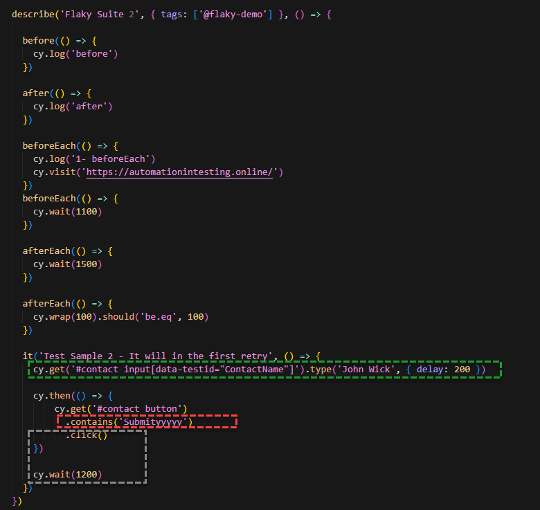
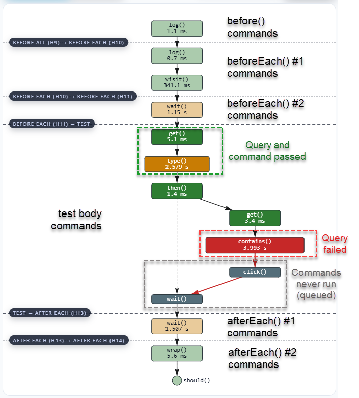
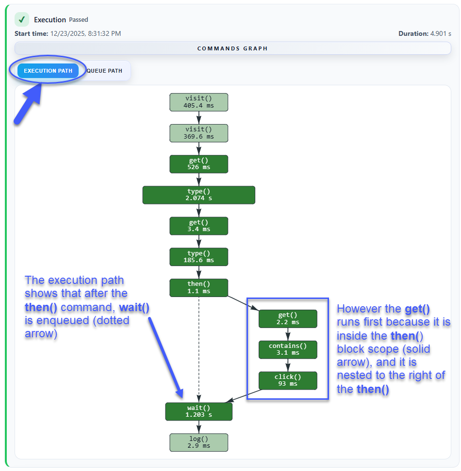
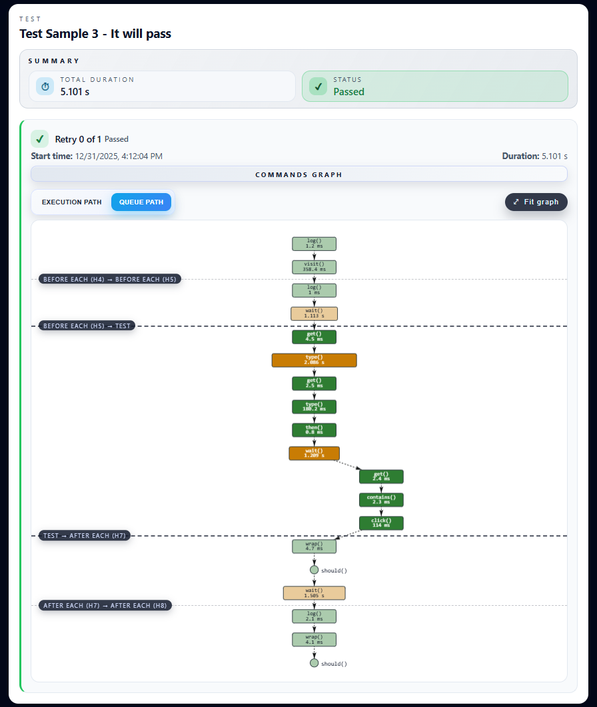
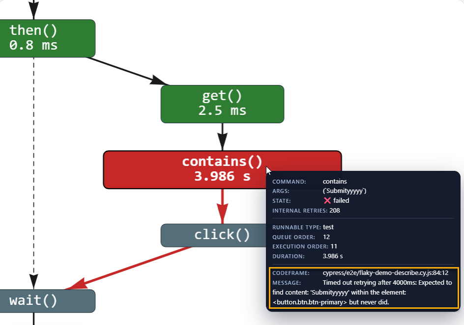

# cypress-flaky-test-audit

A Cypress plugin that tracks the order in which Cypress commands are entered into the command queue and delivers detailed, per-command analytics for your test runs, including execution order, timing, retries, and pass/fail outcomes.

It helps identify flaky tests, performance bottlenecks, and commands that don’t execute, and presents audit results in the browser console, terminal output, and an HTML report with visual graphs of Cypress command execution across your test suite.


Related reading: [The async nature of Cypress – don’t mess with the timelines in your Cypress tests (dual verse)](https://dev.to/sebastianclavijo/the-async-nature-of-cypress-dont-mess-with-the-timelines-in-your-cypress-tests-dual-verse-3ehh)

## Table of Contents

- [Main Features](#main-features)
- [Compatibility](#compatibility)
- [Installation](#installation)
- [Configuration](#configuration)
- [Audit Results](#audit-results)
- [License](#license)
- [Contributing](#contributing)
- [Changelog](#changelog)

## Main Features

✔️ **Command Queue Tracing** – Captures enqueue order, runnable type, nested relationships, and execution transitions for every Cypress command and assertion.

✔️ **Retry-aware Test Timeline** – Stores metadata for each test attempt (start time, duration, retry index, pass/fail state) so you can compare executions side-by-side.

✔️ **Multiple Output Channels** – Choose between browser console, terminal console, and a shareable HTML report enriched with network-style graphs.

✔️ **Slowness Thresholds** – Highlight slow tests and commands with customizable performance budgets.

✔️ **Richer Failure Context** – Failed command tooltips now surface both the code frame (file:line:column) and the underlying error message so you can jump straight to the root cause.

✔️ **Dual Graph Views** – Toggle between **Execution path** (actual run order) and **Queue path** (enqueue order) directly in the report; queue edges render as dotted lines for clarity.

✔️ **Task-free HTML Export** – When enabled, automatically writes a timestamped HTML file per spec under `cypress/reports/flaky-test-audit/`, including:

   - **Suite overview**: Totals (tests, passes/failures), run duration, and metadata.
   - **Test & retry cards**: Per-test status plus a breakdown of each retry (retry index, start time, duration).
   - **Fully interactive command graph (per retry)**: Zoomable/pannable network-style view of the command queue and execution flow, showing nested relationships and state transitions.
   - **Graph modes**: Switch between **Execution path** (nextCommandId links) and **Queue path** (queueInsertionOrder with dotted edges) to reason about run order vs enqueue order.
   - **Tooltips**: Inspect each command’s type, runnable context, timings, internal retries, and (for failures) the exact code frame + error message.
   - **Visual cues**: Quickly spot failures, queued-but-never-run commands, and slow commands (based on your thresholds).
   - **Fully mobile responsive**: 100% responsive to mobile layouts.

✔️ **Minimal setup** – a single import in `cypress/support/e2e.js` plus one helper in `cypress.config.js`.

## Compatibility

- **Cypress**: built and verified with Cypress `^15.7.0`. The plugin relies on modern event hooks and events (`test:before:run`, command lifecycle events), so Cypress `13+` is recommended.
- **Node.js**: match the version supported by your installed Cypress release (Node 16.17+ for Cypress 15).
- **Browsers/Runners**: agnostic – works in headed/headless modes, local or CI, Chromium or Firefox.
- **HTML report graphs**: rendered with the CDN bundle of [vis-network](https://github.com/visjs/vis-network), so an internet connection is required the first time you open a newly generated report to load the assets.

## Installation

```bash
npm install --save-dev cypress-flaky-test-audit
```

1. **Register the plugin tasks** and the audit report folder inside `cypress.config.js` (or `cypress.config.ts`):

    ```js
    const addFlakyTestAuditTasks = require('cypress-flaky-test-audit/src/tasks');

    module.exports = {
      testAuditFolder: 'cypress/reports/flaky-test-audit/',

      // ... rest of config parameters
      e2e: {
        setupNodeEvents(on, config) {
          addFlakyTestAuditTasks(on);

          // .. rest of etupNodeEvents consig
          return config;
        },
        // ...rest of your e2e config
      },
    };
    ```

2. **Enable the audit at runtime** by importing the main hook file at the very beginning of your `cypress/support/e2e.js` file (this will ensure you do not leave out any `beforeEach` and `afterEach` hooks from the test audit for the suite):

    ```js
    import 'cypress-flaky-test-audit';
    ```

3. **Toggle the feature** using Cypress environment variables (see [Configuration](#configuration)).

## Configuration

### Cypress Config File

Set these keys via `cypress.config.{js,ts}` (as a property in the `module.exports`, or in the `e2e` object).

| Config var | Type | Default | Description |
| --- | --- | --- | --- |
| `testAuditFolder` *(Cypress config key)* | `string` | `cypress/reports/flaky-test-audit/` | Destination for generated HTML files. |

Example `cypress.config.js`:

```js
module.exports = {
  testAuditFolder: 'cypress/reports/flaky-test-audit/',

  e2e: {
    setupNodeEvents(on, config) {
      // ...
    },
  },
};
```

### Environment Variables

Set these keys via `cypress.config.{js,ts}` (`env` object), `cypress.env.json`, or CLI `--env` flags.

| Env var | Type | Default | Description |
| --- | --- | --- | --- |
| `enableFlakyTestAudit` | `boolean` | `false` | Master switch. When disabled, no listeners are registered. |
| `flakyTestAuditConsoleType` | `"list" \| "table"` | `table` | Choose how results are printed in the browser and terminal consoles. |
| `testSlownessThreshold` | `number` (ms) | `5000` | Duration above which a test is marked as slow. |
| `commandSlownessThreshold` | `number` (ms) | `1500` | Duration above which a command row is annotated as slow. |
| `createFlakyTestAuditReport` | `boolean` | `false` | Enable HTML report generation after the suite finishes. |
| `testAuditFolder` | `string` | `cypress/reports/flaky-test-audit/` | Destination for generated HTML files. |

Example `cypress.env.json`:

```json
{
  "enableFlakyTestAudit": true,
  "createFlakyTestAuditReport": true,
  "flakyTestAuditConsoleType": "table",
  "testSlownessThreshold": 8000,
  "commandSlownessThreshold": 2000
}
```


## Audit Results

Depending on which outputs you enable, the audit data is presented in three different ways: browser console, terminal console, HTML report.

### Browser Console

- Styled tables or lists (based on the `flakyTestAuditConsoleType` environment variable) rendered directly in the Cypress runner DevTools.
- Great for debugging locally without leaving the browser.
- Output:

  * At the **Test** level, it shows a summary of that test **retry**:
  
    1. Test state:
       - `✔️ PASSED`
       - `✔️ PASSED (⏳ *slow*)` (duration longer than `testSlownessThreshold`)
       - `❌ FAILED`
       - `⛔ QUEUED (*never run*)`.
    2. Test title.
    3. Retry number (when configured for multiple retries).
    4. Start time of the test retry.
    5. Duration of the retry.
    6. Test file relative path.

  * Also, for each Cypress **command** in that test retry:

    1. **`State`**: Whether the command executed successfully or not.

        - **`✔️ PASSED`**: The command ran successfully.
        - **`✔️ PASSED (⏳ *slow*)`**: The command passed but was slower than the threshold set by the `commandSlownessThreshold` environment variable.
        - **`❌ FAILED`**: The command caused the test to fail.
        - **`⛔ QUEUED (*never run*)`**: The command was added to the Cypress queue but never run.
      
    2. **`Runnable type`**: Where the command ran: in a **hook** (`before`, `before each`, `after each`) or in the main `test` **body**.
    3. **`Type`**: The nature of the Cypress command (**Query**, **Parent command**, **Child command**, or **Dual Command**).
    4. **`Command`**: The command being executed with its call arguments (e.g., `VISIT ('https://automationintesting.online/')`).
    5. **`Enqueued order`**: The order in which the command is added to the Cypress queue.
    6. **`Enqueued time`**: Exact time when the command was inserted into the Cypress queue (to millisecond precision).
    7. **`Execution order`**: The order in which the command is executed from the Cypress queue.
    8. **`Start time`**: Exact time when the command was taken from the Cypress queue and started executing (to millisecond precision).
    9. **`Run time`**: Time the command took to run, or time elapsed until the command failed (to millisecond precision).
    10. **`#Internal retries`**: Number of retries performed by Cypress’s internal retry mechanism until the command succeeds or fails.

#### Browser Console Table Format

Test failed in retry #0.


#### Browser Console List Format

Test Passed in retry #1, but the overall execution was slow (more than `testSlownessThreshold`).


### Terminal Console

- Mirrors the browser output through custom `cy.task` handlers (see `cypress-flaky-test-audit/src/tasks.js`).
- Useful for headless and CI logs where you still need per-retry and per-command diagnostics.

#### Terminal Console Table Format

Test Passed in retry #1, but the overall execution was slow (more than `testSlownessThreshold`).


#### Terminal Console List Format

Test Failed in retry #0.


### HTML Report

- Each report contains:

  - Suite overview with total tests, failures, suite run duration, and metadata.

  - Individual test cards summarizing test title, total duration, and test status (passed/failed).

  - For each retry in a test:

    - Retry number, start time, and duration.
    - A fully interactive **command graph** (rendered via `vis-network`) that visualizes the execution timeline, nested executions, and state transitions.
    - **Execution path** view option that shows the real run order (solid edges), while **Queue path** shows enqueue order using dotted edges and queue insertion order.
    - The graph supports zooming, panning, and fitting the entire graph within the visible area.
    - Per-command tooltips with execution details.

- HTML report is written automatically when `createFlakyTestAuditReport` is **`true`**.

- Files are saved as `<spec-name>_<timestamp>.html` in the folder specified by the Cypress config variable `testAuditFolder` (by default, this is `cypress/reports/flaky-test-audit/`).

> You can download the latest example HTML report (showing Execution vs Queue paths and enriched failure tooltips) from [`assets/flaky-demo.html`](assets/flaky-demo.html).

#### HTML report - Overview

This is an overview of a Flaky Test Audit report, showing the suite header with metadata, the list of tests, and each retry that was run for every test.


#### Commands and Assertions

The interactive command graph is designed to help you **read a test run at a glance**: what happened, what failed, what never ran, and where time was spent.

- **Commands & queries** are displayed as **rectangles** in the graph.
  - Inside each rectangle, you'll see the type of command or query (for example: VISIT, GET, etc.) along with how long it took to run.
  - The **wider** the rectangle, the **more time** that command took to execute.
- **Assertions** (like `.should()`) show up as **circles (dots)**, so they’re easy to spot in the flow.
- **Colors mean the same thing everywhere** (commands, queries, assertions):
  - **Green**: passed
  - **Orange**: passed but command execution time was more than the `commandSlownessThreshold`
  - **Red**: failed
  - **Gray**: enqueued (added to the Cypress queue) but **never executed**

Commands, queries, and assertions that belong to the same block scope are shown as nested in the graph (indented).

#### Hooks

Cypress commands that run inside **hooks** (`before`, `beforeEach()`, or `afterEach()`) use the same color rules as commands in the test body, but are shown with a **faded appearance** to distinguish them from the main test commands. 
In the graph, each hook and the test body are placed in separate sections, divided by dotted lines and labeled, making it easy to tell them apart.

For example, given this Cypress test code:



The graph below shows the exact order in which commands were executed, how long each took, and what their final state was after execution:



The execution path shows that just after the `then()` command, `wait()` is enqueued, but `get()` runs first because it's inside the `then()` block scope.

> ⚠️ **IMPORTANT CONSIDERATIONS ABOUT HOW HOOKS ARE SHOWN IN THE TEST AUDIT PLUGIN**
>
> Audit data for each test retry is recorded using an `afterEach()` **hook**, imported at the top of your `e2e.js` file (by `import 'cypress-flaky-test-audit'`). The HTML audit report for the entire suite is generated in an `after()` **hook** it is also defined in that same import.
>
> This means that, depending on which block scope your hooks are defined in your suite file and how Cypress determines hook order, hooks may or may not appear in the test audit reports (both in the console and in the graphs):
>   - `before()` hooks defined in your suite will always be shown for retry #0 of the suite's first test.
>   - `after()` hooks defined in your suite will never be shown in the results.
>   - `beforeEach()` and `afterEach()` hooks defined *inside a block scope* (like within a `describe()` or `context()`) will always be shown in the results.
>   - `beforeEach()` and `afterEach()` hooks defined *at the root level of your file* (not wrapped by `describe()` or `context()`) will never be shown in the results.

#### Execution path VS Queued path

For each retry executed, there are 2 visualizations of the test run: Execution path and Queued path.

- **Execution path**: represents the order in which commands, queries, and assertions were actually **executed**.
- **Queued path**: represents the order in which commands, queries, and assertions were **enqueued** (added to the Cypress command queue).

Execution paths are represented with solid arrows in the graph, and enqueued paths with dotted arrows.

These two orders are not always the same. Because Cypress commands are **queued asynchronously**, commands can be added from inside other command block scopes (for example within a `.then()` callback) or from within a **custom command** implementation. In those cases, Cypress may enqueue some commands later, even though they execute as part of the same overall flow, so the **execution order** and **enqueued order** can diverge.


##### Execution path

To help you see the difference between executed and enqueued commands, the Execution Path graph includes a toggle called **# SHOW QUEUE ORDER**. Turning this on or off will show or hide a label next to each command or assertion, indicating the position at which it was added to the Cypress command queue.



##### Enqueued path



#### Commands Tooltips and box width

Each node in the graph is clickable. When you click a **command**, **query**, or **assertion**, the report opens a tooltip with the most relevant execution details for that node.

- **How to open/close**
  - **Open**: click on a node.
  - **Close**: click on empty space, move the mouse inside the tooltip, or pan/zoom.

- **Tooltip fields (always shown)**
  - **Command**: the Cypress command name (e.g. `visit`, `get`, `should`).
  - **Args**: shows the argument(s) passed to the Cypress command (for example, the selector string or typed value). If there are multiple arguments, all are shown in the order they were passed.
  - **State**:
    - `✔️ passed`
    - `❌ failed`
    - `⛔ queued (never run)` (when it was enqueued but never executed)
    - `⏳ passed (slow)` (when it passed, but took longer than your `commandSlownessThreshold`)
  - **Runnable type**: whether it ran in the **test body** (`test`) or inside a **hook** (`beforeEach`, `afterEach`).
  - **Queue order**: The position at which the command was added to the Cypress command queue.
  - **Execution order**: The position at which the command was actually executed during the test run.
  - **Duration**: how long the command took to run (if it executed).

- **Extra fields (only when the node failed)**
  - **CodeFrame**: best-effort source location in the format `file:line:column`.
  - **Message**: the underlying Cypress error message that caused the failure.

- **Box width (rectangles)**
  - **Rectangles scale with time**: wider boxes mean longer-running commands.
  - **Assertions shown as circles** don’t use box width, but still carry the same tooltip details when clicked.



#### Examples of HTML Report

##### Test passes on the first attempt


##### Test passes after one or more retries


##### Test fails after all retries are exhausted


##### Report fully mobile responsive


## License

Released under the [MIT License](LICENSE).

## Contributing

Contributions are welcome! If you find a bug or want to propose an improvement:

1. Open an issue describing the motivation and expected behavior.
2. Fork the repo and create a branch: `git checkout -b feat/my-improvement`.
3. Run the Cypress suite you care about with the audit enabled to validate changes.
4. Submit a PR referencing the issue. Please include screenshots of the report if the UI changes.

## Changelog

- **1.0.0** – Initial public beta with console outputs and interactive HTML report.

