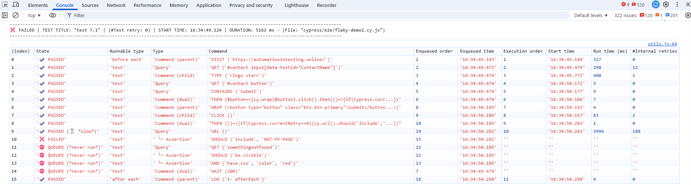
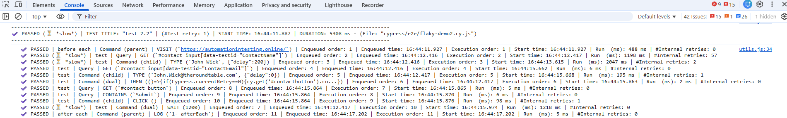
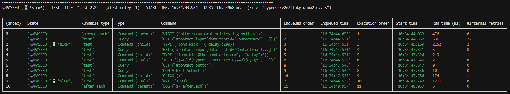
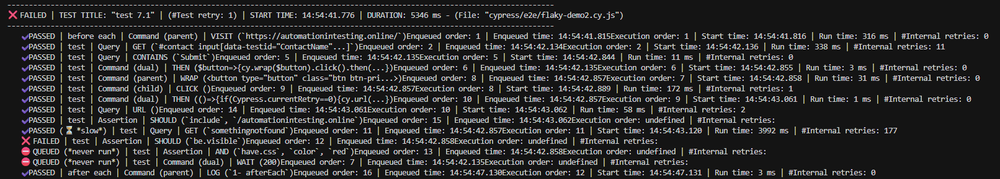
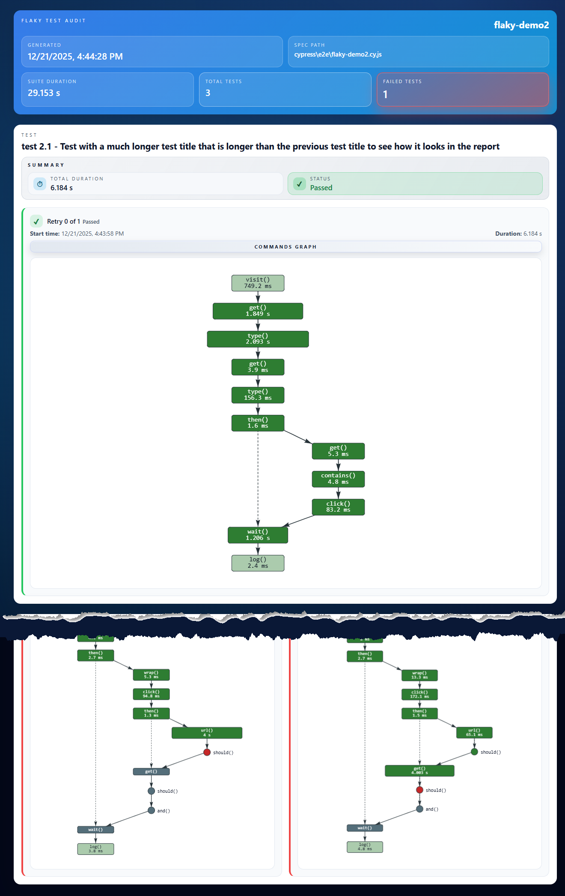
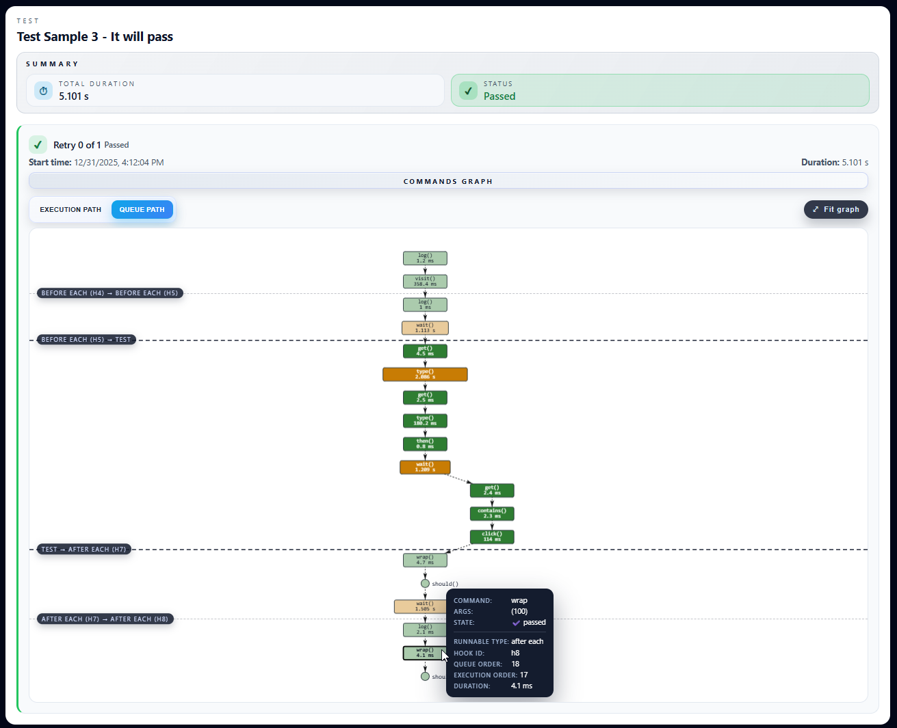
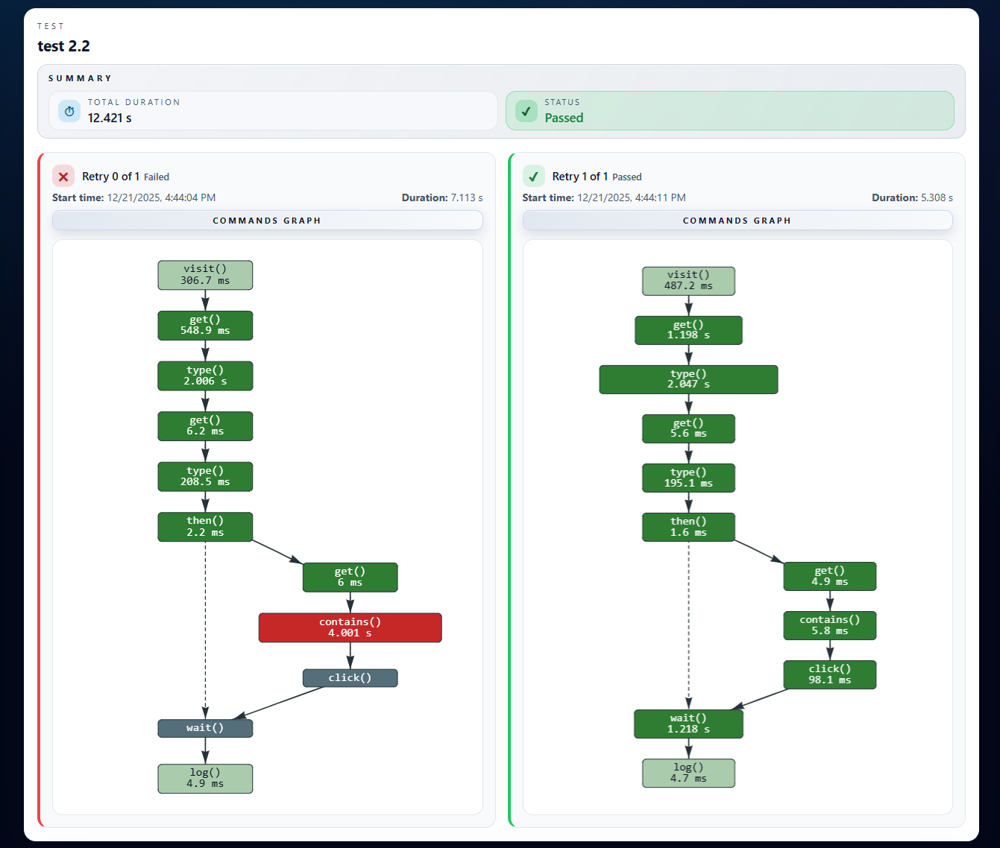
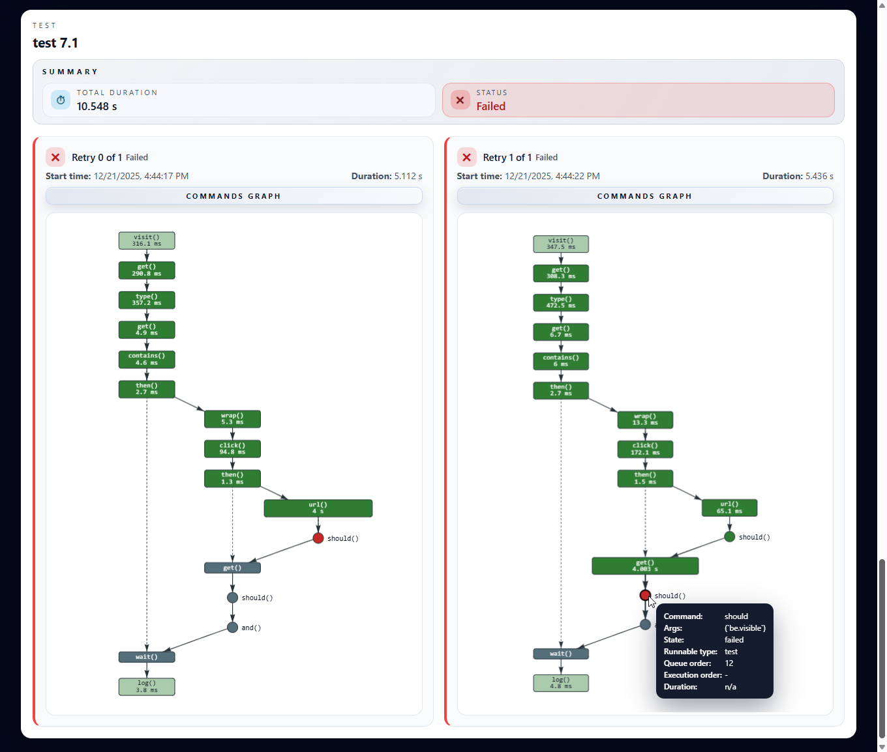
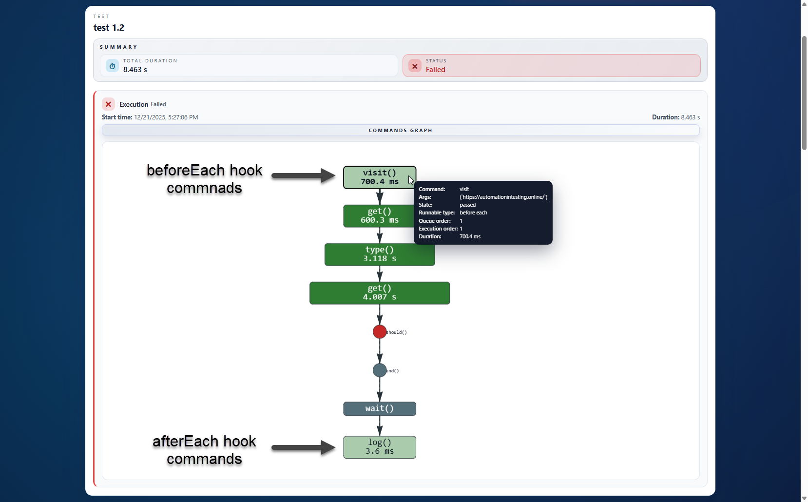

# cypress-flaky-test-audit

A Cypress plugin that tracks the order in which Cypress commands are entered into the command queue and delivers detailed, per-command analytics for your test runs, including execution order, timing, retries, and pass/fail outcomes.

It helps identify flaky tests, performance bottlenecks, and commands that don’t execute, and presents audit results in the browser console, terminal output, and an HTML report with visual graphs of Cypress command execution across your test suite.


Related reading: [The async nature of Cypress – don’t mess with the timelines in your Cypress tests (dual verse)](https://dev.to/sebastianclavijo/the-async-nature-of-cypress-dont-mess-with-the-timelines-in-your-cypress-tests-dual-verse-3ehh)

## Table of Contents

- [Main Features](#main-features)
- [Compatibility](#compatibility)
- [Installation](#installation)
- [Configuration](#configuration)
- [Audit Results](#audit-results)
- [License](#license)
- [Contributing](#contributing)
- [Changelog](#changelog)

## Main Features

✔️ **Command Queue Tracing** – Captures enqueue order, runnable type, nested relationships, and execution transitions for every Cypress command and assertion.

✔️ **Retry-aware Test Timeline** – Stores metadata for each test attempt (start time, duration, retry index, pass/fail state) so you can compare executions side-by-side.

✔️ **Multiple Output Channels** – Choose between browser console, terminal console, and a shareable HTML report enriched with network-style graphs.

✔️ **Slowness Thresholds** – Highlight slow tests and commands with customizable performance budgets.

✔️ **Task-free HTML Export** – When enabled, automatically writes a timestamped HTML file per spec under `cypress/reports/flaky-test-audit/`, including:

   - **Suite overview**: Totals (tests, passes/failures), run duration, and metadata.
   - **Test & retry cards**: Per-test status plus a breakdown of each retry (retry index, start time, duration).
   - **Fully interactive command graph (per retry)**: Zoomable/pannable network-style view of the command queue and execution flow, showing blocks nested relationships and state transitions.
   - **Tooltips**: Inspect each command details on commnad click (type, runnable context, timings, internal retries).
   - **Visual cues**: Quickly spot failures, queued-but-never-run commands, and slow commands (based on your thresholds).
   - **Fully mobile responsive**: 100% responsive to mobile layouts.

✔️ **Minimal setup** – a single import in `cypress/support/e2e.js` plus one helper in `cypress.config.js`.

## Compatibility

- **Cypress**: built and verified with Cypress `^15.7.0`. The plugin relies on modern event hooks and events (`test:before:run`, command lifecycle events), so Cypress `13+` is recommended.
- **Node.js**: match the version supported by your installed Cypress release (Node 16.17+ for Cypress 15).
- **Browsers/Runners**: agnostic – works in headed/headless modes, local or CI, Chromium or Firefox.
- **HTML report graphs**: rendered with the CDN bundle of [vis-network](https://github.com/visjs/vis-network), so an internet connection is required the first time you open a newly generated report to load the assets.

## Installation

```bash
npm install --save-dev cypress-flaky-test-audit
```

1. **Register the plugin tasks** and the audit report folder inside `cypress.config.js` (or `cypress.config.ts`):

    ```js
    const addFlakyTestAuditTasks = require('flaky-test-audit/src/tasks');

    module.exports = {
      testAuditFolder: 'cypress/reports/flaky-test-audit/',

      // ... rest of config parameters
      e2e: {
        setupNodeEvents(on, config) {
          addFlakyTestAuditTasks(on);

          // .. rest of etupNodeEvents consig
          return config;
        },
        // ...rest of your e2e config
      },
    };
    ```

2. **Enable the audit at runtime** by importing the main hook file at the very beginning of your `cypress/support/e2e.js` file (this will ensure you do not leave out any `beforeEach` and `afterEach` hooks from the test audit for the suite):

    ```js
    import 'flaky-test-audit';
    ```

3. **Toggle the feature** using Cypress environment variables (see [Configuration](#configuration)).

## Configuration

### Environment Variables

Set these keys via `cypress.config.{js,ts}` (`env` object), `cypress.env.json`, or CLI `--env` flags.

| Env var | Type | Default | Description |
| --- | --- | --- | --- |
| `enableFlakyTestAudit` | `boolean` | `false` | Master switch. When disabled, no listeners are registered. |
| `flakyTestAuditConsoleType` | `"list" \| "table"` | `table` | Choose how results are printed in the browser and terminal consoles. |
| `testSlownessThreshold` | `number` (ms) | `5000` | Duration above which a test is marked as slow. |
| `commandSlownessThreshold` | `number` (ms) | `1500` | Duration above which a command row is annotated as slow. |
| `createFlakyTestAuditReport` | `boolean` | `false` | Enable HTML report generation after the suite finishes. |
| `testAuditFolder` | `string` | `cypress/reports/flaky-test-audit/` | Destination for generated HTML files. |

Example `cypress.env.json`:

```json
{
  "enableFlakyTestAudit": true,
  "createFlakyTestAuditReport": true,
  "flakyTestAuditConsoleType": "table",
  "testSlownessThreshold": 8000,
  "commandSlownessThreshold": 2000
}
```

### Cypress Config File

Set these keys via `cypress.config.{js,ts}` (as a property in the `module.exports`, or in the `e2e` object).

| Config var | Type | Default | Description |
| --- | --- | --- | --- |
| `testAuditFolder` *(Cypress config key)* | `string` | `cypress/reports/flaky-test-audit/` | Destination for generated HTML files. |


Example `cypress.config.js`:

```js
module.exports = {
  testAuditFolder: 'cypress/reports/flaky-test-audit/',

  e2e: {
    setupNodeEvents(on, config) {
      // ...
    },
  },
};
```

## Audit Results

Depending on which outputs you enable, the audit data is presented in three different ways.

### Browser Console

- Styled tables or lists (based on the `flakyTestAuditConsoleType` environment variable) rendered directly in the Cypress runner DevTools.
- Great for debugging locally without leaving the browser.
- Output:

  * At the **Test** level, it shows a summary of that test **retry**:
  
    1. State: `✔️ PASSED`, `✔️ PASSED (⏳ *slow*)` (duration longer than `testSlownessThreshold`), `❌ FAILED`, `⛔ QUEUED (*never run*)`.
    2. Test title.
    3. Retry number (when configured for multiple retries).
    4. Start time of the test retry.
    5. Duration of the retry.
    6. Test file relative path.

  * Also, for each Cypress **command** in that test retry:

    1. **`State`**: Whether the command executed successfully or not.

        - **`✔️ PASSED`**: The command ran successfully.
        - **`✔️ PASSED (⏳ *slow*)`**: The command passed but was slower than the threshold set by the `commandSlownessThreshold` environment variable.
        - **`❌ FAILED`**: The command caused the test to fail.
        - **`⛔ QUEUED (*never run*)`**: The command was added to the Cypress queue but never run.
      
    2. **`Runnable type`**: Where the command ran: in a **hook** (`before each`, `after each`) or in the main `test` **body**.
    3. **`Type`**: The nature of the Cypress command (**Query**, **Parent command**, **Child command**, or **Dual Command**).
    4. **`Command`**: The command being executed with its call arguments (e.g., `VISIT ('https://automationintesting.online/')`).
    5. **`Enqueued order`**: The order in which the command is added to the Cypress queue.
    6. **`Enqueued time`**: Exact time when the command was inserted into the Cypress queue (to millisecond precision).
    7. **`Execution order`**: The order in which the command is executed from the Cypress queue.
    8. **`Start time`**: Exact time when the command was taken from the Cypress queue and started executing (to millisecond precision).
    9. **`Run time`**: Time the command took to run, or time elapsed until the command failed (to millisecond precision).
    10. **`#Internal retries`**: Number of retries performed by Cypress’s internal retry mechanism until the command succeeds or fails.

#### Browser Console Table Format

Test failed in retry #0.



#### Browser Console List Format

Test Passed in retry #1, but the overall execution was slow (more than `testSlownessThreshold`).




### Terminal Console

- Mirrors the browser output through custom `cy.task` handlers (see `flaky-test-audit/src/tasks.js`).
- Useful for headless and CI logs where you still need per-retry and per-command diagnostics.

#### Terminal Console Table Format

Test Passed in retry #1, but the overall execution was slow (more than `testSlownessThreshold`).



#### Terminal Console List Format

Test Failed in retry #0.




### HTML Report

- Each report contains:

  - Suite overview with total tests, failures, suite run duration, and metadata.

  - Individual test cards summarizing test title, total duration, and test status (passed/failed).

  - For each retry in a test:

    - Retry number, start time, and duration.
    - Fully interactive **command graph** (rendered via `vis-network`) that visualizes the execution timeline, nested executions, and state transitions.
    - Graph supports zooming and panning.
    - And provides per-command tooltips with execution details.

- Written automatically when `createFlakyTestAuditReport` is **`true`**.

- Files are saved as `<spec-name>_<timestamp>.html` in the folder specified by the Cypress config variable `testAuditFolder`.

> You can download an example HTML report of a flaky test audit from [this file](assets/Example-report-flaky-test-audit_2025-12-22T00-44-28.042Z.html).

#### HTML report - Overview



#### HTML report - Test passes on the first attempt and Cypress Command tooltip



#### HTML report - Test passes after one or more retries



#### HTML report - Test fails after all retries are exhausted



#### HTML report - Fully mobile responsive


####  HTML report - Test hook commands and no retries configured

Cypress commands that are part of `beforeEach()` and `afterEach()` hooks are shown in a faded color for clarity.

> ⚠️ Commands that are part of a `before()` or `after()` hook are not included.




## License

Released under the [MIT License](LICENSE).

## Contributing

Contributions are welcome! If you find a bug or want to propose an improvement:

1. Open an issue describing the motivation and expected behavior.
2. Fork the repo and create a branch: `git checkout -b feat/my-improvement`.
3. Run the Cypress suite you care about with the audit enabled to validate changes.
4. Submit a PR referencing the issue. Please include screenshots of the report if the UI changes.

## Changelog

- **1.0.0** – Initial public beta with console outputs and interactive HTML report.

