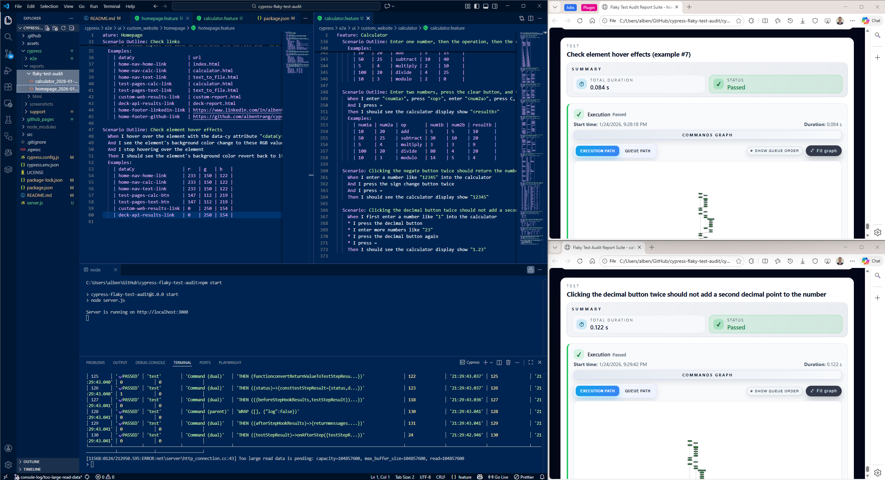

# Bug: Too large read data error in console log

## Description

When running many test cases from multiple test suites from running Cypress in headless mode, the tests will stop, and the console will show an error that looks like this: `Too large read data is pending: capacity=104857600, max_buffer_size=104857600, read=104857600`. Also, given that there are three test suites in this repository, the last test suite will not run at all, and only the first two test suites will generate HTML reports.

## Test Environment

### Machine Details

- OS: Windows 11 Home
- Processor: 12th Gen Intel Core i7-12700F (2.10 GHz)
- RAM: 32 GB
- System Type: 64-bit operating system, x64-based processor

### Packages

- Node.js: v24.13.0
- npm: 11.4.0
- cypress: 15.8.1
- cypress-mochawesome-reporter: 4.0.2
- cypress-on-fix: 1.1.0
- cypress-real-events: 1.15.0
- express: 5.2.1
- @badeball/cypress-cucumber-preprocessor: 24.0.0
- @bahmutov/cypress-esbuild-preprocessor: 2.2.8

## Steps to Reproduce

1. Clone the repository from [GitHub](https://github.com/albentrang/cypress-flaky-test-audit/tree/console-log/too-large-read-data)
2. Download all the packages under the Packages section above (for my projects, I use npm to install these packages: cypress, cypress-mochawesome-reporter, cypress-on-fix, cypress-real-events, express, @badeball/cypress-cucumber-preprocessor, and @bahmutov/cypress-esbuild-preprocessor)
3. Run the website locally by executing `node server.js` or `npm start` in one terminal (you're free to use the URL of my custom website in GitHub pages if you don't want to run an Express server, but please note the website may change in the future: https://albentrang.github.io/cypress-portfolio/)
4. In another terminal, run Cypress in headless mode using the command `npm run custom:run` to test the running website
5. Observe the console log after the first couple of test suites finish executing to see the "Too large read data is pending" error

## Expected Behavior

All test cases should run successfully without any errors in the console log, and each test suite will get HTML reports generated by the audit.

## Actual Behavior

The test suite for the Text to File webpage will not run because Cypress stops executing tests after encountering the "Too large read data is pending" error in the console log. Also, only the first two test suites will generate HTML reports by the audit.

