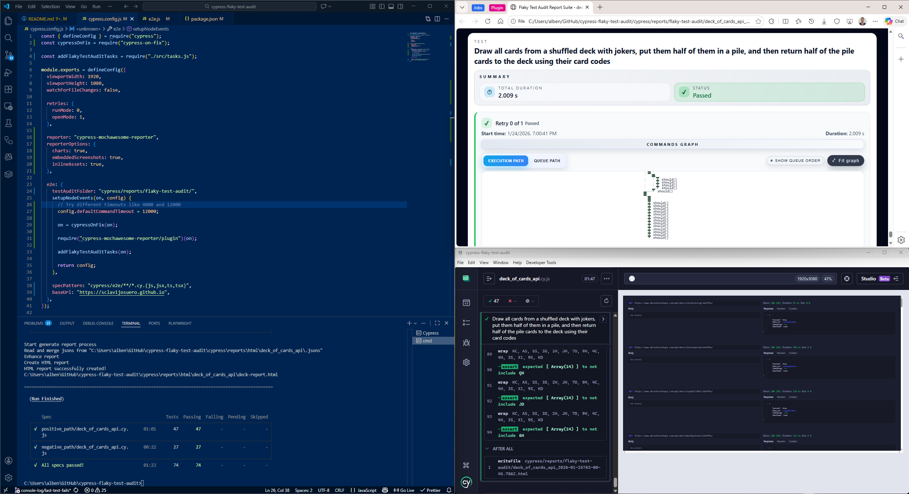
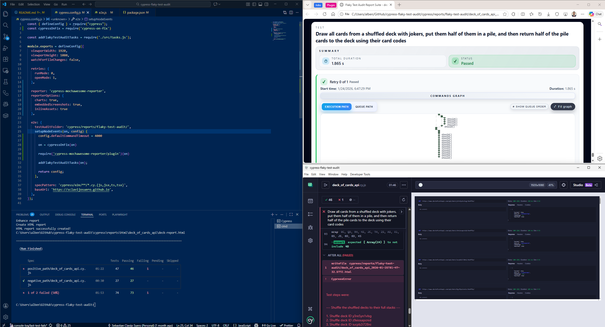

# Bug: Last test case is shown to fail except in the audit's HTML report

## Description

When running a large test suite, the last test case is consistently reported as failed in the console logs and Cypress's UI. However, when inspecting the HTML report generated by the audit, the last test case is correctly shown as passed. The reason for this discrepancy is because, in the last test case, the audit uses an After All hook to write the HTML report. If there is a lot of data to process and the Cypress command timeout is reached before the report is fully written, Cypress marks the last test as failed due to the timeout, even though it actually passed.

## Test Environment

### Machine Details

- OS: Windows 11 Home
- Processor: 12th Gen Intel Core i7-12700F (2.10 GHz)
- RAM: 32 GB
- System Type: 64-bit operating system, x64-based processor

### Packages

- Node.js: v24.13.0
- npm: 11.4.0
- Cypress: 15.9.0
- cypress-mochawesome-reporter: 4.0.2
- cypress-on-fix: 1.1.0
- cypress-plugin-api: 2.11.2
- cypress-plugin-steps: 1.2.0

## Steps to Reproduce

1. Clone the repository from [GitHub](https://github.com/albentrang/cypress-flaky-test-audit/tree/console-log/last-test-fails)
2. Set `config.defaultCommandTimeout` to a low value like 2000 or 4000 in `cypress.config.js`
3. Download all the packages under the Packages section above
4. Run the test suites for testing the Deck of Cards API using either `npm run deck:open` or `npm run deck:run` to open Cypress UI or run in headless mode respectively
5. Observe that the last test case in the positive test suite is marked as failed in the Cypress UI and console logs, but is shown as passed in the HTML report generated by the audit

## Expected Behavior

## Actual Behavior

